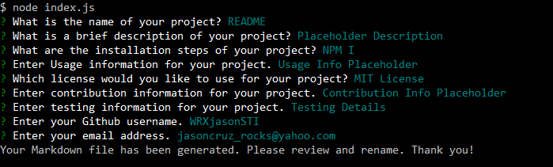
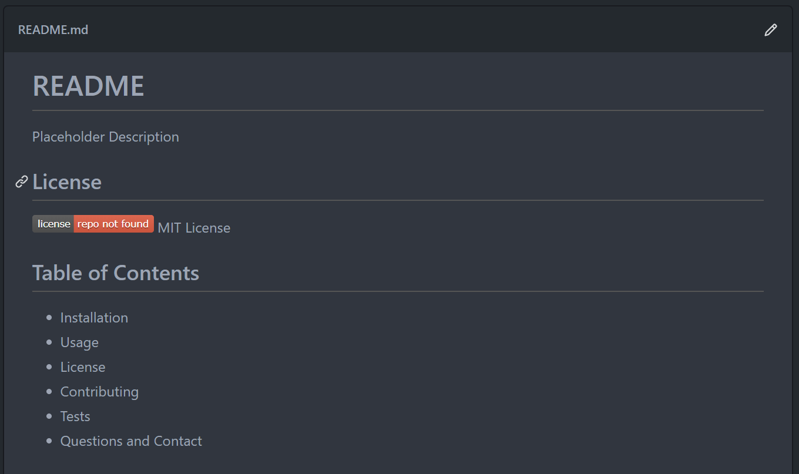

# ReadMe.MD Generator with Node JS

Thank you for viewing my repository. The following repository is for an application run on the Terminal that will generate a Readme file for future projects and repositories. User input will be able to generate a professional-looking "welcome page," or at least a starter template to greet repository visitors. 

### Screenshots

The user interaction will be as follows:  
  
And the finished product:  
  

## License

MIT License 

## Table of Contents

* Installation  
* Usage  
* License  
* Contributing  
* Tests  
* Questions and Contact  

## Installation

```bash
npm i
```

## Usage
```bash
node index.js
```

## Contributing

Am open to all contributions. Please email me for a pull request. 

## Tests

Testing Details 

## Questions and Contact
For any questions and suggestions, please feel free to contact me at the following platforms:
* GitHub: WRXjasonSTI 
* Email: jasoncruz_rocks@yahoo.com 

##
MIT License 
Copyright WRXjasonSTI
    